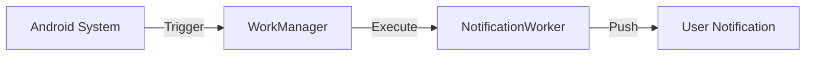

# Loja Social Android: Guia de Arquitetura Técnica


## Summary

Este repositório contém a implementação da aplicação móvel **Loja Social**, desenvolvida nativamente em Kotlin. Adotamos padrões de **Clean Architecture** e **MVVM**, garantindo escalabilidade e separação rigorosa de responsabilidades. Como Arquiteto Sénior, este guia detalha como a solução gere recursos sociais de forma eficiente e segura.

---

## Índice
1. [Cenário da Loja Social](#cenário-da-loja-social)
2. [Interface do Utilizador](#interface-do-utilizador)
3. [Arquitetura de Dados (API)](#arquitetura-de-dados-api)
4. [Android Architecture (Flow)](#android-architecture-flow)
5. [Processamento em Segundo Plano](#processamento-em-segundo-plano)
6. [Discussão Estratégica](#discussão-estatégica)
7. [Equipa](#equipa)

---

## Cenário da Loja Social

A Loja Social é uma plataforma para a gestão de bens doados. Abaixo, a matriz de responsabilidades por perfil:

| Perfil | Responsabilidades Principais |
| :--- | :--- |
| **Funcionário** | Gestão de stock e campanhas, registo de bens e execução de entregas. |
| **Beneficiário** | Consulta de stock e agendamento autónomo de recolhas. |


---

## Interface do Utilizador

Esta secção demonstra a experiência visual da aplicação para os diferentes perfis.

| Dashboard do Funcionário | Agendamento de Entrega | Área do Beneficiário |
| :---: | :---: | :---: |
|  |  |  |

---

## Arquitetura de Dados (API)

A comunicação é estruturada via **REST API**, garantindo consistência entre o cliente Android e o backend.

### DTOs (Data Transfer Objects)

| Modelo | Campos Chave | Propósito |
| :--- | :--- | :--- |
| `StockItem` | `produto`, `quantidadeTotal` | Visão consolidada do inventário. |
| `Beneficiario` | `id`, `nome_completo` | Entidade para gestão de suporte social. |
| `Entrega` | `id`, `estado` | Transação de distribuição de bens. |

<details>
<summary>Ver Implementação da ApiService (Retrofit)</summary>

```kotlin
interface ApiService {
    @GET("api/admin/stock")
    suspend fun getStock(): StockResponse

    @POST("api/auth/login")
    suspend fun login(@Body request: LoginRequest): LoginResponse
}
```
</details>

---

## Android Architecture (Flow)

Adotamos a **Unidirectional Data Flow (UDF)** para garantir que a UI é uma função purista do estado.

### Visualização do Fluxo de Dados


### Detalhes técnicos das camadas

*   **Data Layer**: Segurança centralizada via `AuthInterceptor`.
*   **Domain (Mediator)**: Repositórios que abstraem a origem dos dados.
*   **Presentation**: ViewModels stateless e reativos.

<details>
<summary>Ver Segurança (AuthInterceptor)</summary>

```kotlin
class AuthInterceptor(private val sessionManager: SessionManager) : Interceptor {
    override fun intercept(chain: Interceptor.Chain): Response {
        val request = chain.request().newBuilder().apply {
            sessionManager.fetchAuthToken()?.let { addHeader("Authorization", "Bearer $it") }
        }.build()
        return chain.proceed(request)
    }
}
```


</details>

<details>
<summary>Ver Injeção de Dependências (ViewModelFactory)</summary>

```kotlin
class StockListViewModelFactory(private val repository: StockRepository) : ViewModelProvider.Factory {
    override fun <T : ViewModel> create(modelClass: Class<T>): T {
        return StockListViewModel(repository) as T
    }
}
```

%20.png)
</details>

---

## Processamento em Segundo Plano

Para garantir a fiabilidade operacional, o **WorkManager** gere tarefas assíncronas persistentes, como o `NotificationWorker`.



---

## Discussão Estratégica

A fusão de **MVVM** e **Jetpack Compose** resulta num sistema:
1.  **Imune a inconsistências de UI**: Graças ao estado reativo único.
2.  **Altamente Testável**: Lógica de negócio isolada do framework Android.
3.  **Moderno e Elegante**: Redução drástica de código boilerplate e ficheiros XML.

---

## Equipa

Projeto desenvolvido no âmbito académico no **IPCA** (Engenharia de Sistemas Informáticos).

### Grupo de Trabalho
- **25447** - Ricardo Marques
- **25446** - Vitor Leite
- **25453** - Pedro Vilas Boas
- **25275** - Filipe Ferreira
- **25457** - Danilo Castro


