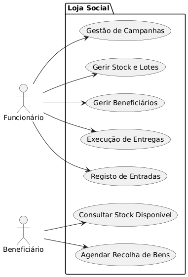
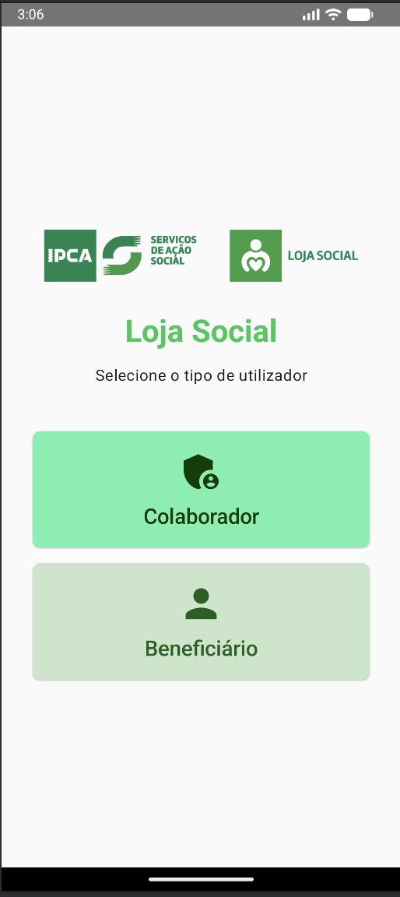
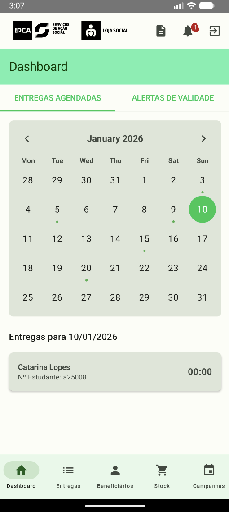
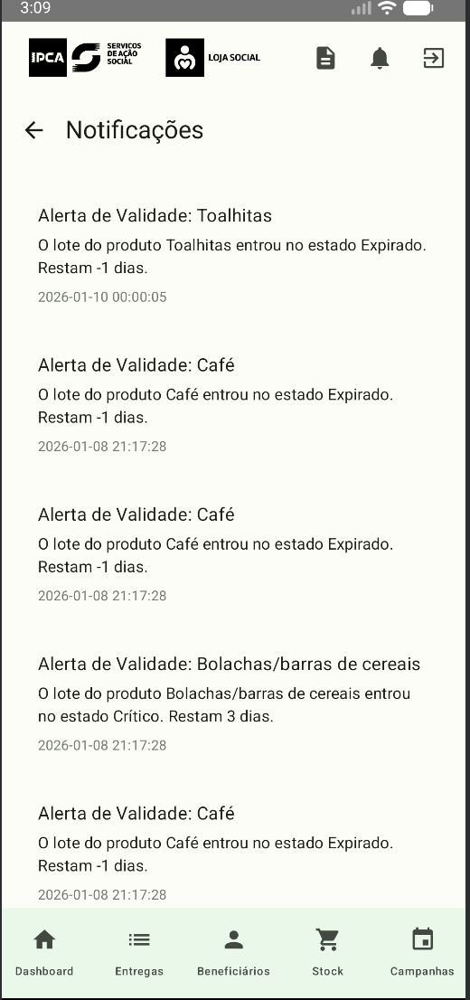
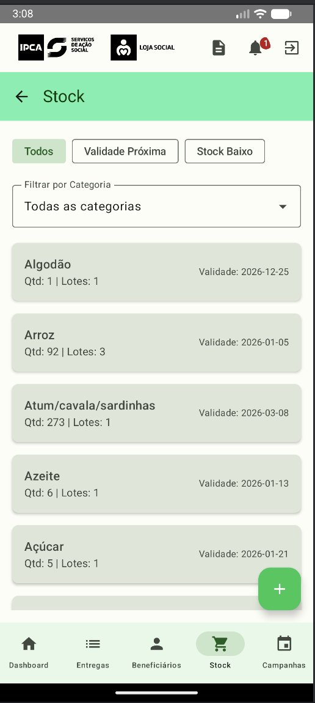
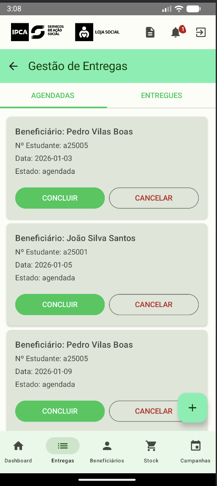
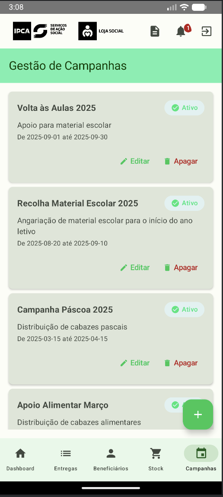
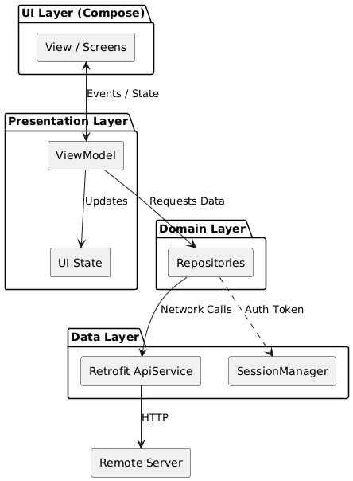
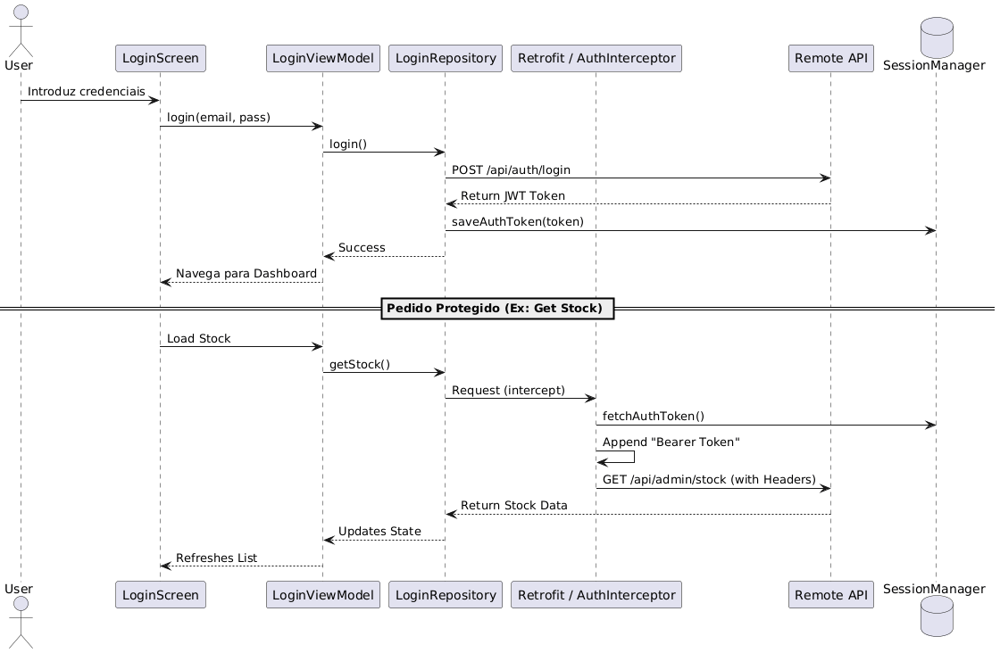

# Loja Social Android: Guia de Arquitetura Técnica


## Summary

Este repositório contém a implementação da aplicação móvel **Loja Social**, desenvolvida nativamente em Kotlin. A solução adota o padrão de arquitetura **MVVM (Model-View-ViewModel)**, garantindo uma separação clara entre a lógica de persistência e a camada de apresentação. Este guia detalha a engenharia por trás da gestão de recursos sociais.

---

## Índice
1. [Cenário da Loja Social](#cenário-da-loja-social)
2. [Interface do Utilizador](#interface-do-utilizador)
3. [Arquitetura de Dados (API)](#arquitetura-de-dados-api)
4. [Android Architecture (Flow)](#android-architecture-flow)
5. [Processamento em Segundo Plano](#processamento-em-segundo-plano)
6. [Decisões de Engenharia](#decisões-de-engenharia)
7. [Equipa](#equipa)

---

## Cenário da Loja Social

A Loja Social é uma plataforma para a gestão de bens doados. Abaixo, a matriz de responsabilidades por perfil:

| Perfil | Responsabilidades Principais |
| :--- | :--- |
| **Funcionário** | Gestão de stock e campanhas, registo de bens e execução de entregas. |
| **Beneficiário** | Consulta de stock e agendamento autónomo de recolhas. |



---

## Interface do Utilizador

Esta secção apresenta a interface visual da aplicação, demonstrando a implementação dos requisitos de gestão e interação para os diferentes perfis.

| Autenticação | Dashboard Beneficiário | Notificações |
| :---: | :---: | :---: |
|  |  |  |

| Gestão de Stock | Gestão de Entregas | Gestão de Campanhas |
| :---: | :---: | :---: |
|  |  |  |

---

## Arquitetura de Dados (API)

A comunicação é estruturada via **REST API**, garantindo consistência entre o cliente Android e o backend.

### DTOs (Data Transfer Objects) e Mapeamento
A fidelidade dos dados é garantida através de modelos fortemente tipados. O uso de DTOs isola a aplicação móvel de mudanças estruturais diretas no banco de dados do servidor.

| Modelo | Campos Chave | Propósito |
| :--- | :--- | :--- |
| `StockItem` | `produto`, `quantidadeTotal` | Visão consolidada do inventário disponível. |
| `Beneficiario` | `id`, `nome_completo` | Gestão de utilizadores com apoio social. |
| `Entrega` | `id`, `estado` | Auditoria de transações de saída de bens. |

<details>
<summary>Ver Implementação da ApiService (Retrofit)</summary>

```kotlin
interface ApiService {
    @GET("api/admin/stock")
    suspend fun getStock(): StockResponse

    @POST("api/auth/login")
    suspend fun login(@Body request: LoginRequest): LoginResponse
}
```
</details>

---

## Android Architecture (Flow)

A aplicação utiliza o padrão **Unidirectional Data Flow (UDF)** para garantir previsibilidade de estado e facilitar a depuração.

### Visualização do Fluxo de Dados



### O Racional das Camadas

*   **Repository Layer (Single Source of Truth)**: O repositório atua como o mediador central de dados. A sua responsabilidade é abstrair a origem da informação, permitindo que os ViewModels consumam dados de forma agnóstica à rede ou persistência local.
*   **ViewModel Layer**: Responsável por transformar dados brutos em ecrãs prontos para consumo. Utiliza `StateFlow` para emitir novos estados de UI baseados em ações do utilizador ou eventos externos.
*   **Presentation (Compose)**: Uma camada puramente reativa onde a UI é uma função direta do estado atual, eliminando estados inconsistentes comuns em sistemas baseados em Views tradicionais.

<details>
<summary>Ver Segurança (AuthInterceptor)</summary>

```kotlin
class AuthInterceptor(private val sessionManager: SessionManager) : Interceptor {
    override fun intercept(chain: Interceptor.Chain): Response {
        val request = chain.request().newBuilder().apply {
            sessionManager.fetchAuthToken()?.let { addHeader("Authorization", "Bearer $it") }
        }.build()
        return chain.proceed(request)
    }
}
```


</details>

<details>
<summary>Ver Injeção de Dependências (ViewModelFactory)</summary>

```kotlin
class StockListViewModelFactory(private val repository: StockRepository) : ViewModelProvider.Factory {
    override fun <T : ViewModel> create(modelClass: Class<T>): T {
        return StockListViewModel(repository) as T
    }
}
```

%20.png)
</details>

---

## Processamento em Segundo Plano

Tarefas que não podem sofrer interrupções pelo ciclo de vida da UI — como lembretes de agendamento ou alertas de rutura de stock — são delegadas ao **WorkManager**. Esta escolha técnica garante a execução fiável das tarefas, respeitando as restrições de sistema e otimizando o consumo de bateria.

---

## Decisões de Engenharia

Para além dos padrões de arquitetura, foram adotadas decisões estratégicas para garantir a longevidade do projeto:

1.  **Reatividade com Flow**: O uso de `Flow` e `StateFlow` permite um processamento assíncrono fluido, reduzindo o acoplamento entre os repositórios e a UI.
2.  **Segurança Abstrata**: A centralização do token JWT no `AuthInterceptor` garante que a segurança é uma regra de infraestrutura e não uma preocupação recorrente em cada nova funcionalidade.
3.  **Modularidade Funcional**: Embora a app seja um monólito, a separação por domínios (Stock, Entregas, Utilizadores) facilita uma futura transição para módulos ou micro-features caso a escala do projeto o exija.

---

## Equipa

Projeto desenvolvido no âmbito académico no **IPCA** (Engenharia de Sistemas Informáticos).

- **25447** - Ricardo Marques
- **25446** - Vitor Leite
- **25453** - Pedro Vilas Boas
- **25275** - Filipe Ferreira
- **25457** - Danilo Castro
