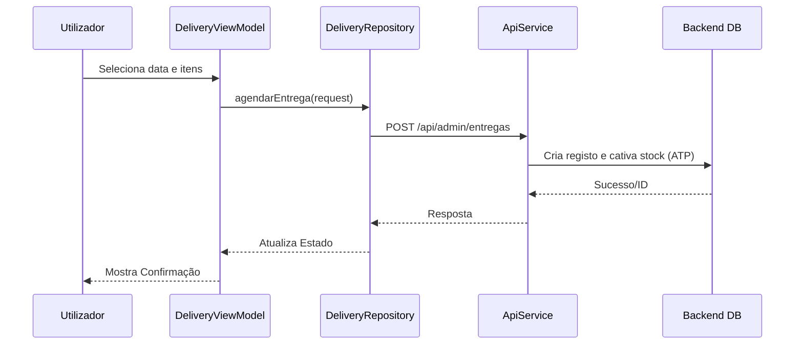

# Relatório de Projeto: Loja Social Android

## 1. Introdução
A **Loja Social** é uma iniciativa que visa apoiar alunos e membros da comunidade académica através da redistribuição de bens essenciais. Este projeto consiste no desenvolvimento de uma aplicação móvel Android que permite a gestão eficiente do inventário, beneficiários e agendamento de entregas, garantindo a rastreabilidade e o controlo de validade dos produtos.

## 2. Análise de Requisitos
A aplicação foi desenvolvida para cumprir os seguintes requisitos funcionais principais:
- **Gestão de Autenticação**: Acesso seguro para administradores e beneficiários.
- **Gestão de Beneficiários**: Registo e manutenção de dados de alunos e outros beneficiários.
- **Controlo de Inventário**: Gestão de stock por lotes, categorias e alertas de validade.
- **Agendamento de Entregas**: Reserva de stock e calendarização de levantamentos.
- **Sistema de Notificações**: Alertas em background para entregas próximas e produtos a expirar.
- **Relatórios**: Geração de documentos PDF para análise de operações e auditoria.

## 3. Arquitetura do Sistema
O sistema segue os princípios de **Clean Architecture** e o padrão de desenho **MVVM (Model-View-ViewModel)**, garantindo uma separação clara de responsabilidades.

### Stack Tecnológica
- **Linguagem**: Kotlin
- **Interface**: Jetpack Compose (Material 3)
- **Networking**: Retrofit + OkHttp (Autenticação via Interceptor)
- **Persistência Temporária**: StateFlow & LiveData
- **Processamento em Background**: WorkManager

### Diagrama de Fluxo de Dados (Agendamento de Entrega)

## 4. Detalhes de Implementação

### 4.1. Gestão de Stock e Validade
O sistema implementa uma lógica de **lotes**, permitindo que o mesmo produto tenha diferentes datas de validade. Existe um motor de regras que categoriza os alertas em:
- **Crítico**: 0-7 dias para expirar.
- **Atenção**: 8-14 dias.
- **Brevemente**: 15-30 dias.

### 4.2. Motor de Reservas (ATP)
Ao agendar uma entrega, o stock não é abatido imediatamente do total físico, mas sim "reservado" (`quantidade_reservada`). Apenas na conclusão da entrega (`concluirEntrega`) é que o stock é efetivamente subtraído, garantindo que não há sobreposições de pedidos.

## 5. Análise de Gaps
| Requisito | Estado | Observação |
| :--- | :--- | :--- |
| Login Seguro | ✅ Completo | JWT com refresh automático. |
| Gestão de Stock | ✅ Completo | Suporte a lotes e categorias. |
| Notificações | ✅ Completo | WorkManager a correr a cada 4h. |
| Registo de Quebras | ⚠️ Parcial | Implementado na BD, requer interface dedicada. |
| Leitura Biométrica | ❌ Não Inc. | Fora do âmbito inicial. |

## 6. Conclusão e Trabalhos Futuros
A aplicação Loja Social Android fornece uma ferramenta robusta para o dia-a-dia da operação. Como desenvolvimentos futuros, recomenda-se a integração de leitura de códigos de barras para acelerar a entrada de stock e a implementação de um modo offline para situações de baixa conectividade.

---
*Gerado automaticamente para o projeto Loja Social.*
